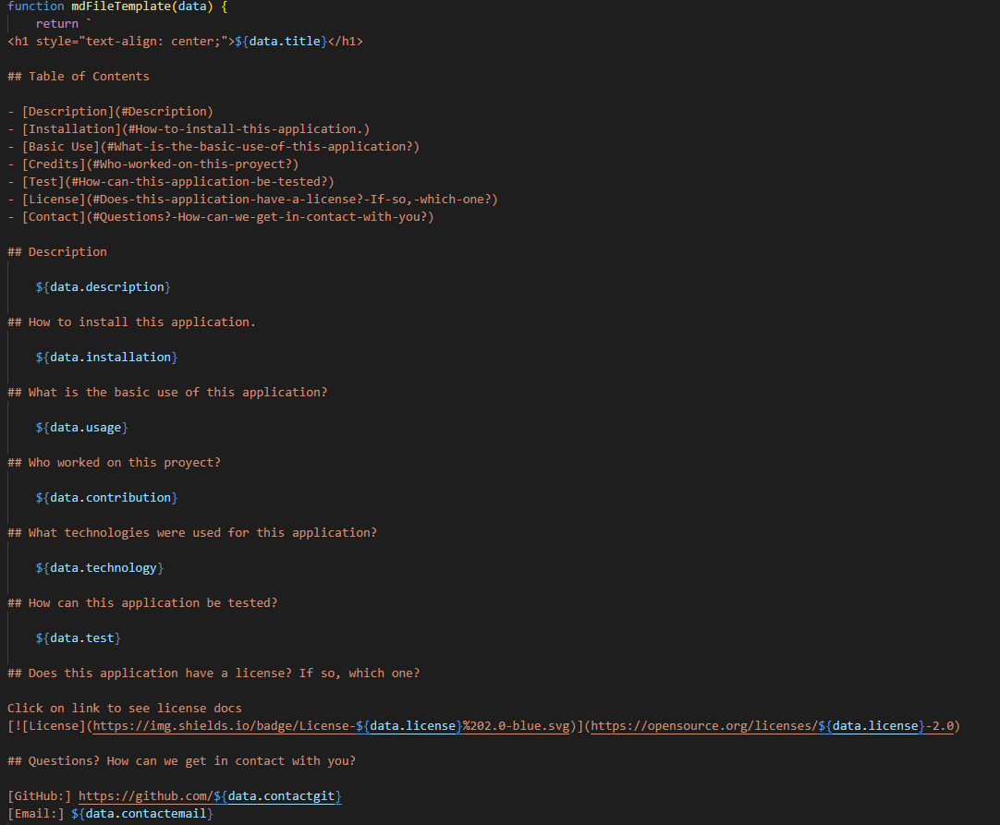
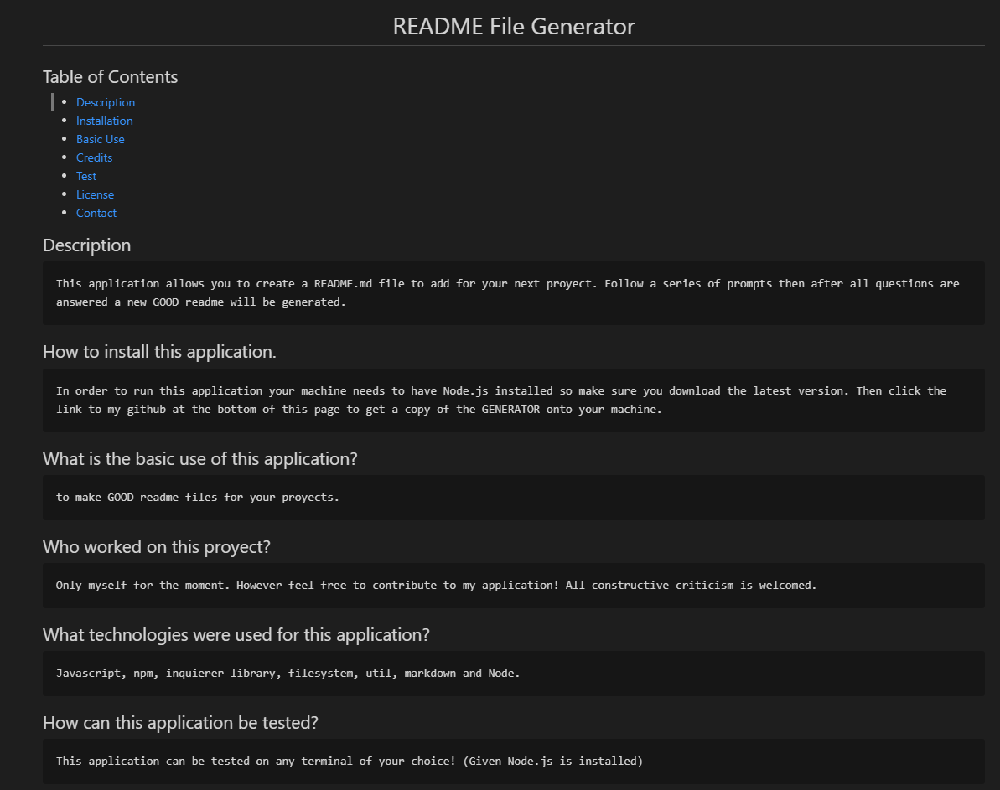

<h1 style="text-align: center;">README File Generator</h1>

## Table of Contents

- [Table of Contents](#table-of-contents)
- [Description](#description)
- [How to install this application.](#how-to-install-this-application)
- [What is the basic use of this application?](#what-is-the-basic-use-of-this-application)
- [Who worked on this proyect?](#who-worked-on-this-proyect)
- [What technologies were used for this application?](#what-technologies-were-used-for-this-application)
- [How can this application be tested?](#how-can-this-application-be-tested)
- [Does this application have a license? If so, which one?](#does-this-application-have-a-license-if-so-which-one)
- [Questions? How can we get in contact with you?](#questions-how-can-we-get-in-contact-with-you)
- [Images of code](#images-of-code)
- [Video Walkthrough](#video-walkthrough)

## Description

    This application allows you to create a README.md file to add for your next proyect. Follow a series of prompts then after all questions are answered a new GOOD readme will be generated.

## How to install this application.

    In order to run this application your machine needs to have Node.js installed so make sure you download the latest version. Then click the link to my github at the bottom of this page to get a copy of the GENERATOR onto your machine.

## What is the basic use of this application?

    to make GOOD readme files for your proyects.

## Who worked on this proyect?

    Only myself for the moment. However feel free to contribute to my application! All constructive criticism is welcomed.

## What technologies were used for this application?

    Javascript, npm, inquierer library, filesystem, util, markdown and Node.

## How can this application be tested?

    This application can be tested on any terminal of your choice! (Given Node.js is installed)

## Does this application have a license? If so, which one?

Click on link to see license docs 

## Questions? How can we get in contact with you?

[GitHub:] https://github.com/Milan1422
[Email:] jmilan.gonzalez@gmail.com

## Images of code

## Video Walkthrough

[Walkthrough:] https://drive.google.com/file/d/1dB82iKva49HKzqX2Ayhx2dpCfUBFBWF_/view

    